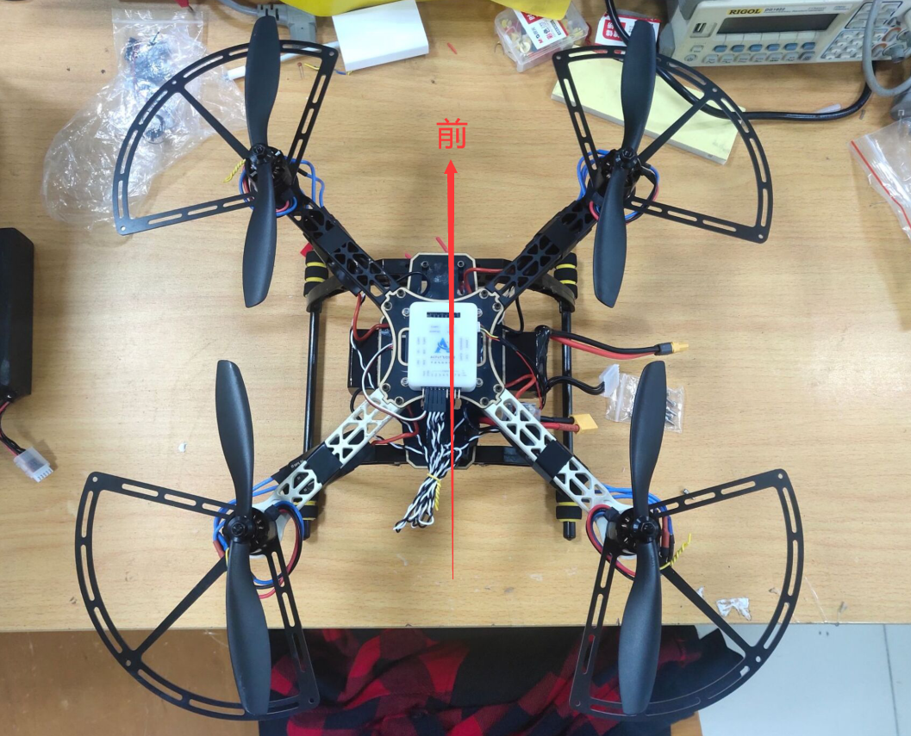

# WHU_drone

无人机安装&调试流程

#### 1.无人机组装

组装无人机机架，焊接电调、电流计和开关。注意：需要剪断电流计，将开关接在电流计输入端之前。**不能装桨**。

**电源接线一定要再三确认正确**

**电源接线一定要再三确认正确**

**电源接线一定要再三确认正确**

#### 2.稳压连接

参照ACFLY PROPHET用户手册11章。

需要将电流计的六线输出改用GH1.25 4P接入飞控的PowerADC。端口电流计6个输出引脚信号与PowerADC端口对应关系如下表所示。其中，**VCC和GND在12、和56脚中任选其一即可**。

Pix电流计与PowerADC端口对应关系

| 引脚             | 1红  | 2黑  | 3黑        | 4黑     | 5黑  | 6黑  |
| ---------------- | ---- | ---- | ---------- | ------- | ---- | ---- |
| 信号             | VCC  | VCC  | CURRENT    | VOLTAGE | GND  | GND  |
| 对应PowerADC引脚 | 4    | 4    | 2          | 1       | 3    | 3    |
| 对应PowerADC信号 | 5V   | 5V   | CurrentADC | BatADC  | GND  | GND  |

连接效果示意图

**电源接线一定要再三确认正确**

**电源接线一定要再三确认正确**

**电源接线一定要再三确认正确**

#### 3.遥控器设置

遥控器装入四节五号电池供电，**盒子和说明书不要丢**。同时长按两开关键开机，触摸屏幕上的设置按钮进入设置。

在系统-输出模式中选择PPM S.BUS

在功能-辅助通道中设置通道

将567通道设置如下表的对应关系

| 通道5    | 通道6    | 通道7    |
| -------- | -------- | -------- |
| 开关-SwD | 开关-SwA | 开关-SwC |

#### 4.接收机对码

如下图所示连接接收机和飞控，接收机连接I-BUS下的SERV0口，白色为信号线，在最右；飞控上连接S.BUS口，白色信号线在最上。将对码线连接到接收机的B/VCC口。

上电，参照遥控器说明书打开遥控器设置，在系统-对码中完成对码。

对码完成后**妥善保管对码线。**

#### 5.遥控器校准

参考B站视频https://www.bilibili.com/video/BV1E5411s7Wi

#### 6.电机电调校准

**\**刷入固件前在电脑上安装好DFU驱动**

##### **刷入电机电调校准固件（第一次刷）

用USB线连接飞控和电脑，打开地面站软件，连接，进入配置-固件更新

选择群里的”电调校准固件（拆桨！重新上电！校准完烧回原本固件！）.hex“刷入。固件烧进飞控，插电池给飞控和电调电机重新上电，之后会听到电调滴滴-嘀嘀嘀的声音，表示校准完成。

##### **编译最新代码，刷回固件（第二次刷）

打开ACFly工程，在Option中设置编译器为default complier version 6

编译

用USB连接飞控，打开地面站软件，刷入工程目录下的\Object\ACFly.hex

#### 7.检查调整电机方向

**不要上桨**，固定好飞控以及机头方向后，将无人机、遥控器分别开机。待启动程序结束，飞控单绿色呼吸灯后，遥控器打内八保持一会，电机会开始转动。用手摸电机的侧面感受其转动方向。正确转动方向如下图所示

正确转动方向

如果有反转的，调换电调与电机连接线中的任意两根，并再次检查。

#### 8.上桨，检查桨叶方向

上桨，每相邻桨叶应该呈相反方向，并且一定要拧紧。

正确安装方向

按与6相同的步骤，让电机转动，**不要动油门**，用手感受是否四个电机都向下吹风。

#### 9.参数调整

用USB连接飞控，在地面站软件配置-参数表修改以下参数并写入

Bat-BatVoltMKp改为11，保存

AC-AC_Pitch_b, AC_Roll_b改为9，保存

在配置-参数调整中，将电池节数改为4s，写入

连接电池，使用哔哔响测量电池电压，与地面站接收的测得电池电压比对，如相差不大，即设置成功。

#### 10.温度校准、加速计校准和磁罗盘校准

参照用户手册5.4、5.5、5.6

#### 11.飞行

**测试时保证两人以上**

**测试时保证两人以上**

**测试时保证两人以上**

飞机、遥控器开机后等待初始化结束，飞控亮绿色呼吸灯。

遥控器打双内八解锁

左摇杆为油门，上下推动控制飞机上升下降，回中为保持当前高度；右摇杆控制前后左右四个方向，**操作时一定要明确飞机的前后左右方向**。不熟练的情况下**不要动左摇杆的左右方向（即偏航）**。

起飞时迅速推动油门操控飞机上升离地。

降落时轻轻下拉油门，操控飞机缓慢下降，并调整方向。飞机降落后将油门打到左下角，**保持一段时间，直到飞控亮绿色呼吸灯为止**，即停机。

**千万不可在空中停机**

**千万不可在空中停机**

**千万不可在空中停机**

